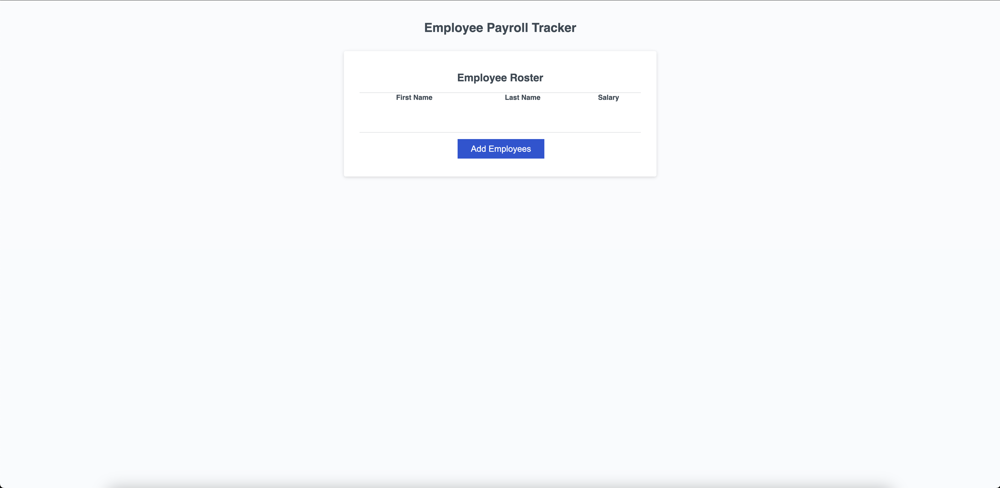

# Employee-Payroll-Tracker

## Description

This is my updated repository for the UC Berkeley eDX Bootcamp's challenge for Week 3: JavaScript. I  originallycompleted this challenge to display my understanding of the fundamentals of JavaScript; it specifically displays usage of variables, loops, arrays, functions, and a number of other common JavaScript concepts.

This repository takes the unsolved code provided for Week 3's unit and updates it to include a working collectEmployees function, which allows a user to add employees to the page's chart. This updated code also includes completed displayAverageSalary and getRandomEmployee functions, which calculate average employee salary and select a randomly employee respectively.

This particular, updated assigned changes the code so the salary alert will now only accept a number, the user being prompted to try again if they attempt to enter anything else. Additionally, it reorganizes the folders so the CSS and JS are located in separate, individually labeled folders with the larger "Assets" folder.

Completing this project has helped display and reinforce my knowledge of basic JavaScript concepts in a project with discernable utility.

## Installation

To install, please clone this repository to your computer using the following steps:

1. Click the "Code" dropdown menu and copy the SSH URL.
2. Open your terminal and navigate to the directory you would like to clone this repository into.
3. Type "git clone <paste SSH URL>", replacing <paste SSH URL> with your copied SSH URL.
4. Press enter.

## Usage

To view this site, either visit the link <https://jacobmca.github.io/Employee-Payroll-Tracker/> or open the Employee-Payroll-Tracker/index.html file on any major browser from your computer.

## Screenshot

## Credits

Created by Jacob McAuliffe for the UC Berkeley eDX Coding Boot Camp.

## License

MIT License

Copyright (c) 2024 Jacob McAuliffe

Permission is hereby granted, free of charge, to any person obtaining a copy
of this software and associated documentation files (the "Software"), to deal
in the Software without restriction, including without limitation the rights
to use, copy, modify, merge, publish, distribute, sublicense, and/or sell
copies of the Software, and to permit persons to whom the Software is
furnished to do so, subject to the following conditions:

The above copyright notice and this permission notice shall be included in all
copies or substantial portions of the Software.

THE SOFTWARE IS PROVIDED "AS IS", WITHOUT WARRANTY OF ANY KIND, EXPRESS OR
IMPLIED, INCLUDING BUT NOT LIMITED TO THE WARRANTIES OF MERCHANTABILITY,
FITNESS FOR A PARTICULAR PURPOSE AND NONINFRINGEMENT. IN NO EVENT SHALL THE
AUTHORS OR COPYRIGHT HOLDERS BE LIABLE FOR ANY CLAIM, DAMAGES OR OTHER
LIABILITY, WHETHER IN AN ACTION OF CONTRACT, TORT OR OTHERWISE, ARISING FROM,
OUT OF OR IN CONNECTION WITH THE SOFTWARE OR THE USE OR OTHER DEALINGS IN THE
SOFTWARE.

